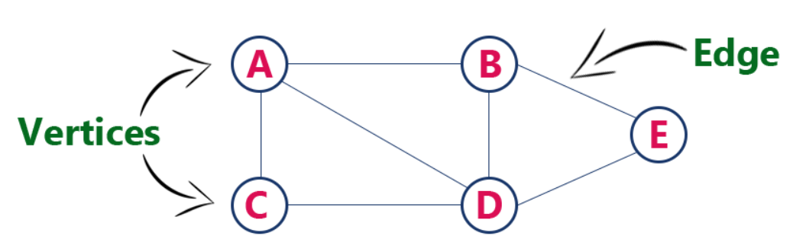
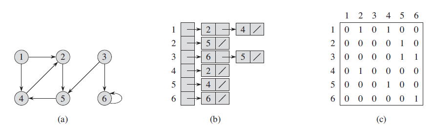
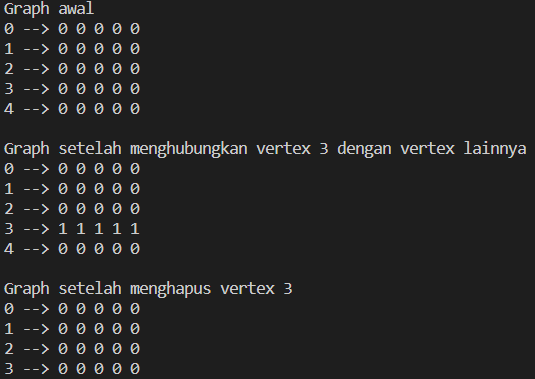

# Graph
Graph atau graf adalah struktur data non-linear yang merupakan kumpulan dari node-node (*Vertices*) yang memiliki koneksi antara satu dengan lainnya (*Edges*). Secara formal graf dapat didefinisikan sebagai kumpulan *edge* dan *vertex* dengan notasi $G=(E,V)$.

Berikut adalah visualisasi dari graph:



Graph sering kali digunakan untuk merepresentasikan hubungan objek-objek yang terinterkoneksi, seperti:

- Peta: merepresentasikan interkoneksi perkotaan dan jalan, dimana kota direresentasikan sebagai *vertex* dan jalanan yang menghubungi antar kota sebagai *edge*
- Sitemap: merepresentasikan interkoneksi antar laman dari sebuah situs, dimana laman direpresentasikan sebagai *vertex* dan link antar laman sebagai *edge*
- Sosial Media: merepresentaikan interkoneksi pertemanan antar pengguna, dimana pengguna direpresentasikan sebagai *vertex* dan hubungan pertemanan sebagai *edge*

## Konsep Implementasi Graph
Graph memiliki dua komponen dalam implementasinya yaitu node (*vertex*) dan hubungan antar node (*edge*):

- node: merupakan objek yang terinterkoneksi pada graph. Biasanya diimplementasikan menggunakan `Class` yang menyimpan tipe data dari objek.
- hubungan node: merupakan hubungan-hubungan antar node. Biasanya diimplementasikan menggunakan `Adjacency List` atau `Adjacency Matrix`.

## Adjacency List dan Adjacency Matrix
Adjacency list dan adjacency matrix adalah dua metode yang sering digunakan yntuk merepresentasikan hubungan node. Berikut adalah visualisasi dari keduanya. 



Arti tiap poin:
<ol type='a'>
    <li> visualisasi graph <i>G</i></li>
    <li> visualisasi adjacency list dari graph <i>G</i></li>
    <li> visualisasi adjacency matrix dari graph <i>G</i></li>
</ol>

**Adjacency List** merepresentasikan hubungan antar node menggunakan array of list ((atau list of list) dengan array sebesar jumlah node yang ada ($V$). Setiap sel dari array $Adj[V_i]$ mempunyai list dengan daftar lengkap node-node yang dapat dituju oleh node $V_i$. Berikut adalah contoh sesuai gambar diatas:

- `adj[1] = 2 --> 4 --> /`, artinya node `1` memiliki hubungan menuju node `2` dan `4`.
- `adj[2] = 5 --> /`, artinya node `2` memiliki hubungan menuju node `5`.
- `adj[3] = 6 --> 5 --> /`, artinya node `3` memiliki hubungan menuju node `6` dan `5`
- `adj[6] = 6 --> /`, artinya node `6` memiliki hubungan menuju node `6` yaitu dirinya sendiri.
- dst.

**Adjacency Matrix** merepresentasikan hubungan antar node dengan array 2D sebesar $V^2$. Setiap sel dari array 2D $Adj[i][j]$ menunjukkan hubungan dari node $V_i$ menuju node $V_j$ dimana nilai $1$ menunjukkan adanya hubungan dan nilai $0$ menunjukkan tidak adanya hubungan. Berikut adalah contoh sesuai gambar diatas:

- `adj[1][1]` bernilai $0$, artinya tidak ada hubungan dari node `1` menuju node `1`.
- `adj[1][2]` bernilai $1$, artinya ada hubungan dari node `1` menuju node `2`.
- `adj[2][1]` bernilai $0$, artinya tidak ada hubungan dari node `2` menuju node `1`.
- `adj[6][6]` bernilai $1$, artinya ada hubungan dari node `6` menuju node `6` yaitu dirinya sendiri.

### Adjacency List VS Adjacency Matrix
Berikut adalah beberapa perbandingan kompleksitas operasi untuk adjacency list dan adjacency matrix:

- Kompleksitas Penyimpanan
    - **Adjacency matrix**: membutuhkan matrix sebesar $V×V$ sehingga memiliki kompleksitas $O(|V^2|)$
    - **Adjacency list**: menyimpan hubungan setiap node dalam bentuk list, sehingga membutuhkan $O(V)$ untuk setiap *vertex* dan $O(E)$ untuk setiap *edge*, dengan total $O(|V|+|E|)$
- Menambah *Vertex*
    - **Adjacency matrix**: diimplementasikan menggunakan array, sehingga untuk menambah *vertex* harus dilakukan perubahan besar array. Untuk merubah besar array, array harus dihapus dan dibuat ulang dengan besar yang diinginkan, sehingga memiliki kompleksitas $O(|V^2|)$
    - **Adjacency list**: memiliki kompleksitas yang berbeda berdasarkan struktur data yang digunakan untuk menyimpan *vertex*. 
        - **Array**: kompleksitasnya adalah $O(|V|+|E|)$ karena harus didefinisikan ulang. 
        - **List**: kompleksitasnya adalah $O(1)$ karena tidak perlu didefinisikan ulang.
- Mengurangi *Vertex*
    - **Adjacency Matrix**: Sama halnya dengan mengurangi *vertex* array harus didefinisikan ulang sehingga memiliki kompleksitas $O(|V^2|)$
    - **Adjacency List**: memiliki kompleksitas berbeda berdasarkan struktur data yang digunakan untuk menyimpan *vertex*:
        - **Array**: kompleksitasnya adalah $O(|V|+|E|)$ karena harus didefinisikan ulang.
        - **List**: kompleksitasnya adalah $O(|V|+|E|)$ karena menghapus *vertex* dalam sebuah list $O(V)$, dan harus menghapus seluruh *edge* untuk *vertex* tersebut $O(E)$.
- Menambah *Edge*
    - **Adjacency Matrix**: kompleksitasnya adalah $O(1)$ karena tiap elemen array dapat diakses dengan waktu konstan.
    - **Adjacency List**: kompleksitasnya adalah $O(1)$ karena pada list terdapat pointer yang menuju elemen akhir list sehingga dapat menambahkan elemen baru secara langsung.
- Mengurangi *Edge*
    - **Adjacency Matrix**: kompleksitasnya adalah $O(1)$ karena tiap elemen array dapat diakses dengan waktu konstan.
    - **Adjacency List**: kompleksitasnya adalah $O(|E|)$ karena list harus di-*traverse* terlebih dahulu sebelum menemukan *edge* yang ingin dihapus.
- Query
    - **Adjacency Matrix**: untuk mengecek hubungan antara dua *vertex* ($V_i$ ke $V_j$), nilai $Adj[i][j]$ harus dicek. Nilai $Adj[i][j]$ dalam $O(1)$
    - **Adjacency List**: untuk mengecek hubungan antara dua *vertex* ($V_i$ ke $V_j$), kita harus mencari $V_j$ dalam $Adj[V_i]$. Setiap *vertex* dapat memiliki hubungan paling banyak sebanyak $V$ sehingga memiliki kompleksitas $O(|V|)$

## Contoh Kode Graph
Berikut adalah contoh sederhana implementasi Graph menggunakan adjacency matrix:
```cpp
#include <iostream>
#include <vector>
using namespace std;

// banyak vertex pada graph
class Graph {
    private:
        // menyimpan banyak vertex dan adj matrix
        int numVertex;
        vector<vector<int>> adjMatrix;
        // fungsi unguk menginisialisasi adjacency matrixs
        vector<vector<int>> initializeMatrix(int numVertex) {
            return vector<vector<int>>(numVertex, vector<int>(numVertex, 0));
        }
        // fungsi untuk mengecek apakah vertex berada pada graph atau tidak
        bool isValid(int vertex) {
            return (0 <= vertex && vertex <= numVertex);
        }
    public:
        // constructor untuk mengisi nilai private variable
        Graph(int numVertex) {
            this->numVertex = numVertex;
            this->adjMatrix = initializeMatrix(numVertex);
        }

        // fungsi untuk menambah x vertex ke graph
        void addVertex(int count = 1) {
            numVertex += count; 
            int prevSize = adjMatrix.size();
            for(int i = 0; i < prevSize; i++) {
                for(int j = 0; j < count; j++) {
                    adjMatrix.push_back(vector<int>(numVertex, 0));
                    adjMatrix[i].push_back(0);
                }
            }    
        }

        // fungsi untuk mengurangi vertex x dari graph
        void removeVertex(int vertexPosition) {
            if(!isValid(vertexPosition)) {
                cout << "input tidak valid\n";
            }

            adjMatrix.erase(adjMatrix.begin() + vertexPosition);
        }

        // fungsi untuk menambah hubungan antar vertex
        void addEdge(int srcVertex, int dstVertex) {
            if(!isValid(srcVertex) && !isValid(dstVertex)) {
                cout << "input tidak valid\n";
            }
               
            adjMatrix[srcVertex][dstVertex] = 1;
        }

        // fungsi untuk menghapus hubungan antar vertex
        void removeEdge(int srcVertex, int dstVertex) {
            if(!isValid(srcVertex) && !isValid(dstVertex)) {
                cout << "input tidak valid\n";
            }

            adjMatrix[srcVertex][dstVertex] = 0;
        }

        // fungsi untuk mengecek hubungan antara 2 vertex
        int query(int srcVertex, int dstVertex) {
            if(!isValid(srcVertex) && !isValid(dstVertex)) {
                cout << "input tidak valid\n";
            }

            return adjMatrix[srcVertex][dstVertex];
        }

        // fungsi untuk mem-print graph
        void printGraph() {
            for (int i = 0; i < adjMatrix.size(); i++) {
                cout << i << " --> ";
                for (int j = 0; j < adjMatrix[i].size(); j++) {
                    cout << adjMatrix[i][j] << " ";
                }    
                cout << endl;
            }
        }
};
```

Contoh pemakaian graph:
```cpp
int main() {
    printf("Graph awal\n");
    Graph myGraph = Graph(5);
    myGraph.printGraph();
    printf("\n");

    printf("Graph setelah menghubungkan vertex 3 dengan vertex lainnya\n");
    myGraph.addEdge(3, 0);
    myGraph.addEdge(3, 1);
    myGraph.addEdge(3, 2);
    myGraph.addEdge(3, 3);
    myGraph.addEdge(3, 4);
    myGraph.printGraph();
    printf("\n");

    printf("Graph setelah menghapus vertex 3\n");
    myGraph.removeVertex(3);
    myGraph.printGraph();
    printf("\n");
    return 0;
}
```


Berikut adalah hasil dari kode diatas:


