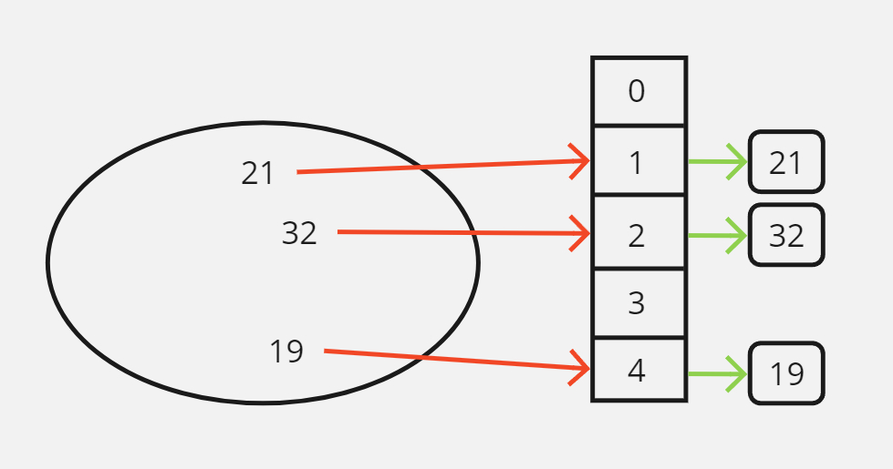
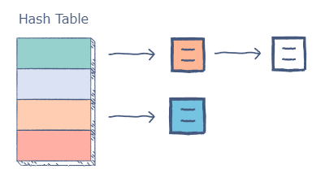
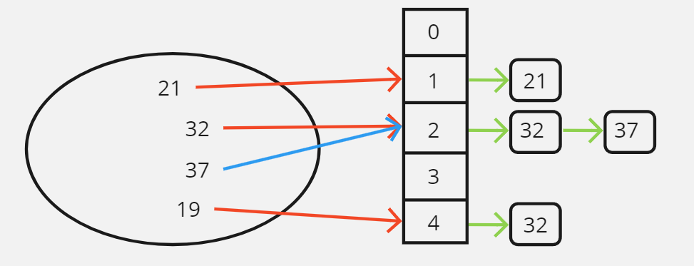
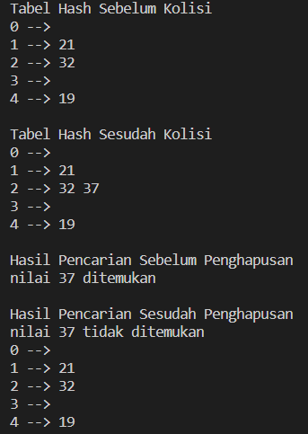

# Hash Table
Hash table atau hash map adalah struktur data yang digunakan untuk mengoptimaklan performa pencarian sebuah nilai dengan mengimplementasikan fungsi hash. Dengan mengimplementasikan hash table, kita dapat mengoptimalkan performa pencarian menjadi $O(1)$ untuk kasus terbaik dan $O(n)$ untuk kasus terburuk. 

## Konsep Hash Table
Hash table memanfaatkan dua komponen dalam implementasinya yaitu array dan fungsi hash:

- array, dengan menggunakan array kita dapat mengakses nilai pada array tersebut dalam $O(1)$.
- fungsi hash, dengan menggunakan fungsi hash kita dapat memetakan nilai yang ingin disimpan ke posisi tertentu dalam sebuah array.

Dengan menggunakan kedua komponen ini kita dapat mendesain sebuah penyimpanan data dengan performa yang sangat baik, dimana pada kasus terbaiknya, setiap nilai hanya memerlukan $O(1)$ untuk diakses.

## Cara Kerja Hash Table
Seumpama kita ingin menyimpan:

- 3 nilai yaitu `19, 21, dan 32` 
- kedalam sebuah `Array` berkapaitas 5 
- dengan fungsi hash sebagai berikut
```cpp
int hash(int nilai) {
    int posisi = nilai % 5;
    return posisi;
}
```
Maka posisi nilai yang disimpan akan dihitung oleh fungsi hash seperti berikut:

- posisi 19 dihitung `19 % 5 = 4`, artinya nilai 19 akan disimpan di index ke-4.
- posisi 21 dihitung `21 % 5 = 1`, artinya nilai 21 akan disimpan di index ke-1.
- posisi 32 dihitung `32 % 5 = 2`, artinya nilai 32 akan disimpan di index ke-2.



Kemudian, apabila suatu saat kita perlu mencari nilai-nilai tersebut, kita tidak perlu menggunakan algoritma pencarian karena kita dapat langsung menghitung posisi sebuah nilai menggunakan fungsi hash, berikut adalah contoh sederhana

```cpp
int find(int array, int nilai) {
    int posisi = hash(nilai);
    return array[posisi];
}
```
## Bentrokan atau Collision dalam Hashing
Collision dalam hashing adalah fenomena yang terjadi ketika terdapat lebih dari satu nilai yang dipetakan oleh fungsi hash kepada posisi yang sama. 

Collision dapat ditangani dengan beberapa teknik, salah satunya dengan menerapkan konsep **chaining**, yaitu menggunakan linked-list disetiap index array, sehingga nilai yang mengalami bentrokan tetap dapat disiman di dalam linked-list index array tersebut. 



Berikut adalah contoh terjadinya collision. Seumpama dengan fungsi hash berikut
```cpp
int hash(int nilai) {
    int posisi = nilai % 5;
    return posisi;
}
```
Kita ingin menyimpan nilai `37` kedalam hash table berikut


Maka yang akan terjadi adalah

- posisi 32 dihitung `37 % 5 = 2`, artinya nilai 32 akan disimpan di index ke-2.
- ternyata sudah terdapat nilai di index ke-1 yaitu 32.
- nilai 37 dimasukkan ke linked-list setelah nilai 32.



Karena hash table ini menggunakan linked-list, pencarian nilai kurang lebih seperti berikut:

```cpp
int find(int array, int nilai) {
    int posisi = hash(nilai);
    int hasil = linearSearch(array[posisi], nilai);
    return hasil;
}
```

## Contoh Kode Hash Table
Kode untuk class `HashTable`:
```cpp
#include <iostream>
#include <list>
#include <algorithm>
using namespace std;

// besar array tabel hash
template <int TABLE_SIZE>
class HashTable {
    private:
        // inisialisasi linked list untuk setiap index array
        list<int> tableList[TABLE_SIZE];
        // fungsi hash tabel hash
        int getHash(int value) {
            return value % TABLE_SIZE;
        }
    public:
        // fungsi untuk menyimpan nilai
        void insert(int value) {
            int hash = getHash(value);
            tableList[hash].push_back(value);
        }
        // fungsi untuk menghapus nilai
        void destroy(int value) {
            int hash = getHash(value);
            tableList[hash].erase(remove(tableList[hash].begin(), tableList[hash].end(), value), tableList[hash].end());
        }
        // fungsi untuk mencari nilai
        void search(int value) {
            int hash = getHash(value);
            list<int>::iterator result = find(tableList[hash].begin(), tableList[hash].end(), value);
            if(result != tableList[hash].end()) {
                printf("nilai %d ditemukan\n", value);
            } else {
                printf("nilai %d tidak ditemukan\n", value);
            }
        }
        // fungsi untuk meng-print tabel
        void printTable() {
            for(int i = 0; i < TABLE_SIZE; i++) {
                printf("%d --> ", i);
                for (auto const &value : tableList[i]) {
                    cout << value << ' ';
                }
                printf("\n");
            }
        }
};
```

Contoh pemakaian hash table:
``` cpp
int main() {
    // inisialisasi tabel
    HashTable<5> tabelHash;

    // demo insert
    tabelHash.insert(21);
    tabelHash.insert(32);
    tabelHash.insert(19);
    printf("Tabel Hash Sebelum Kolisi\n");
    tabelHash.printTable();
    printf("\n");

    // demo collision
    tabelHash.insert(37);
    printf("Tabel Hash Sesudah Kolisi\n");
    tabelHash.printTable();
    printf("\n");

    // demo search
    printf("Hasil Pencarian Sebelum Penghapusan\n");
    tabelHash.search(37);
    printf("\n");
    
    // demo destroy
    tabelHash.destroy(37);
    printf("Hasil Pencarian Sesudah Penghapusan\n");
    tabelHash.search(37);
    tabelHash.printTable();
    printf("\n");
    
    return 0;
}
```

Berikut adalah hasil dari kode diatas:
