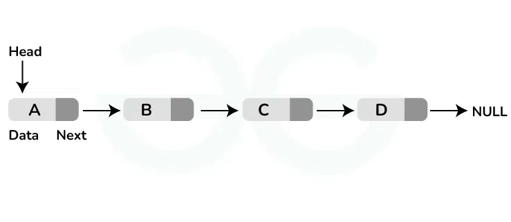
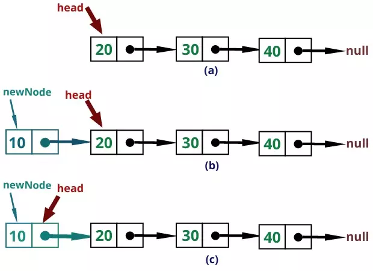
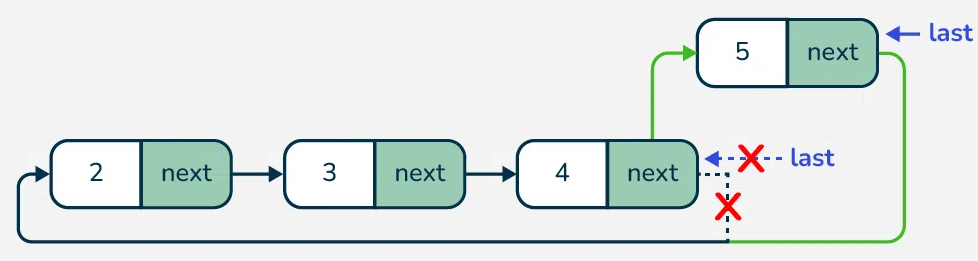
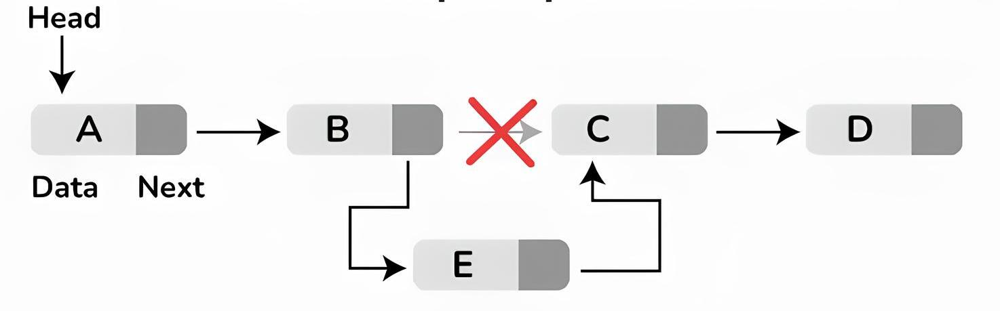

## Daftar Isi
1. [Traversal of Singly Linked List](#traversal-of-singly-linked-list)
2. [Searching in Singly Linked List](#searching-in-singly-linked-list)
3. [Length of Singly Linked List](#length-of-singly-linked-list)
4. [Insertion in Singly Linked List](#insertion-in-singly-linked-list)
5. [Deletion (front, back, spec pos)](#deletion)
6. Modify Linked List — *coming soon*
7. Reversing Linked List — *coming soon*

---

## Traversal of Singly Linked List
<!-- konten bab 1 -->
<p align="justify">
<code>Traversal</code>, atau iterasi, adalah operasi yang menjelajahi setiap elemen dalam suatu struktur data. Pada linked list, traversal berarti mengunjungi setiap node satu per satu dari head(node pertama) hingga tail(node terakhir).
</p>

<p align="justify">
ide utama untuk melakukan traversal di linked list
1. Inisialisasi pointer salinan <code>curr</code> yang menunjuk <code>head</code>.
2. Ulangi dengan <code>while</code> selama <code>curr != nullptr</code>.
3. Proses data di node saat ini (mis. <code>print</code>, hitung, ubah, dsb.).
4. Geser pointer: <code>curr = curr->next</code>.
</p>

```cpp


void traversal_linkedList(Node* head){
    //membuat salinan pointer,agar head asli tidak bergeser saat iterasi
    Node* curr = head;
    while(curr != nullptr){ 
        std::cout << curr->data << " ";
        //pointer penunjut bergerak ke node selanjutnya

        curr = curr->next;
    }
    std::cout<<std::endl;
}
```
**time complexity = O(n),Auxiliary Space O(1)**





<p align="justify">
Iterasi pada linked-list dilakukan dengan menggerakkan pointer kerja (misalnya. <code>curr</code>) dari head hingga elemen terakhir; sepanjang proses, pointer head sendiri tidak pernah bergeser, sehingga setelah loop selesai (ketika curr sudah nullptr) Anda tetap memiliki pegangan utuh ke daftar—dan, jika sebelumnya menyimpan pointer ke node terakhir (tail), Anda bisa langsung menambah simpul baru di ujung (insert-at-end) tanpa perlu menelusuri ulang dari awal.
</p>
## Searching in Singly Linked List
<p align="justify">
<code>Searching (pencarian)</code> adalah operasi untuk menemukan nilai tertentu dalam struktur data. Pada singly linked list, metode yang lazim dipakai adalah linear search: kita menelusuri node dari head ke tail sampai data cocok atau daftar habis. Algoritmanya O(n) waktu dan O(1) ruang. Binary search tidak praktis di linked list karena tidak ada akses acak ke elemen tengah.
</p>

<p align="justify">
ide utama searching pada linked list
1.  inisialisasi node pointer(misal <code>curr</code>)
2.  lakukan traversal     
    - jika element sekarang sama dengan key(<code>curr->data = key</code>) maka return <code>true</code>
    - jika tidak gerakkan node pointer ke element selanjutnya(<code>curr = curr->next</code>)
3.  jika key tidak ditemukan maka return <code>false</code>
</p>

```cpp
bool searching(Node *head,int cari){
    Node* curr = head;
    while(curr != nullptr){
        if(curr->data == cari){
            return true;
        }   
        curr = curr->next;
    }
    return false;
}
```
**time complexity = O(n),Auxiliary Space O(1)**


<!-- konten bab 2 -->

## Length of Singly Linked List
<p align="justify">
<code>length(panjang)</code> dari sebuah linked list adalah banyaknya Node atau element dalam struktur data linked list,ini penting agar kita dapat mengolah data dengan efisien.
</p>

<p align="justify">
ide utama untuk mendapatkan panjang dari linked list
1. inisialisasi sebuah counter untuk menampung nilai(misal <code>length = 0</code>)
2. buat pointer penunjuk(misal <code>curr</code>)
3. lakukan iterasi sampai <code>tail</code>(node terakhir)
4. tiap iterasi increment(naikkan) counter += 1
5. gerakkan pointer ke element selanjutnya(<code>curr = curr->next</code>)
</p>

```cpp
void lenght_LinkedList(Node* head){
    Node* curr = head;
    int lenght = 0;
    while(curr != nullptr){
        lenght++;
        curr = curr->next;
    }
    std::cout << "panjang linked list: " << lenght << std::endl;
}
```
**time complexity = O(n),Auxiliary Space O(1)**


<!-- konten bab 3 -->

## Insertion in Singly Linked List
<p align="justify">
<code>Insert</code>(memasukkan) adalah operasi untuk menyisipkan atau menambahkan nilai dalam sebuah linked list,dalam praktiknya kita mengenai 3 insertion yaitu <code>InsertionAtFront</code>(insertion didepan),<code>InsertionAtEnd</code>(Insertion diakhir),dan <code>InsertionSpecPosition</code>(insertion di posisi tertentu),nah kita akan membahas ketiganya
</p>

### 1.InsertionAtFront
<p align="justify">
<code>Insertion At front</code> berarti kita menyisipkan nilai dari depan,dengan kata lain nilai yang kita insert akan menjadi element paling pertama,pada array kita melakukan operasi ini dengan menggeser nilai lainnya kekanan,di linked list alih-alih melakukan itu kita justru membuat node baru dan menghubungkannya dengan node head.(lihat gambar)
</p>



<p align="justify">
ide utama untuk melakukan insertion dari depan
1. buatlah node baru(misal new_data) untuk dijadikan head yang baru sekaligus menyimpan nilai
2. hubungkan node(new_data->next = head) tersebut ke head
3. kembalikan pointer node yang kita buat(return new_data);
</p>

```cpp
Node* InsertionAtFront(Node* head,int data_baru){
    Node* new_node = new Node(data_baru);
    
    new_node->next = head;
    
    return new_node;
}
```
**time complexity = O(1),Auxiliary Space O(1)**


### 2.InsertionAtEnd
<p align="justify">
<code>Insertion At End</code> berarti kita menyisipkan nilai dari belakang,dengan menyisipkan dari belakang maka nilai yang kita sisipkan akan menjadi tail(element terakhir),karena penunjuk saat diloop tidak tereset saat iterasi berakhir maka kita dapat memanfaatkan ini untuk menyisipkan nilai dari belakang
</p>



<p align="justify">
ide utama untuk melakukan insertion dari belakang
1. buat Node baru(misal <code>new_node</code>) untuk menampung nilai
2. jika head bernilai nullptr berarti linked list kosong maka kembalikan new_node
3. buat pointer penunjuk(misal last)
4. traversal linked list sampai akhir Node(tail)
5. pada saat penunjuk sudah sampai pada tail(node terakhir) maka hubungkan dengan new_node
</p>

```cpp
Node* InsertionAtEnd(Node* head,int data_baru){
    Node* new_node = new Node(data_baru);
    //jika linked list kosong
    if(head == nullptr){
        return new_node;
    }
    Node* last = head;

    while(last->next != nullptr){
        last = last->next;
    }

    last->next = new_node;

    return head;
}
```
**time complexity = O(n),Auxiliary Space O(1)**

<p align="justify">
nah,jika kita melihat metode insertion sebelumnya,pada <code>inserrt at front</code> kita mengembalikan new_node sementara pada saat <code>insert at end</code> kita malah mengembalikan head,nah itu dikarenakan semua operasi yang kita selanjutnya kita wajib mengembalikan pointer <code>head</code>,pada operasi At Front kita menyisipkan nilai yang nantinya akan menjadi head,makanya kita mengembalikan new_node
</p>

### 3.Insertion at a Specific Position(Soon)

<p align="justify">
Ide utama untuk melakukan Insertion di posisi tertentu
1.buat node baru sebagai pointer penunjuk(misal <code>curr</code>)
2.Buat node baru untuk menampung nilai(misal <code>new_node</code>)
3.Traverse(looping) linked list sampai <code>node</code> posisi - 1
4.Simpan sementara node setelah curr ke new_node->next → new_node->next = curr->next.
5.Sambungkan <code>curr->next</code> ke <code>new_node</code> → <code>curr->next = new_node</code>.  
6.return <code>head</code>
</p>

<p align="justify">
anda dapat melihat visualisasinya dibawah 
</p>

```cpp
 Node* InsertionSpecPos(Node* head,int pos,int data){
    if(pos < 1){
        return head;
    }
    //jika pos  = head,maka ubah data menjadi head = insertAtFront
    if(pos == 1){
        Node* curr = new Node(data);    
        curr->next = head;
        return curr;
    }

    Node* curr = head;

    //traverse sampai pos - 1
    for(int i = 0;i < pos - 1 && curr != nullptr;i++){
        curr = curr->next;
    }
    //jika posisi curr melebihi jumlah element node
    if(curr == nullptr){
        return head;
    }

    Node* new_node = new Node(data); 
    new_node->next = curr->next;
    curr->next = new_node;
    return head;   
 }
```
**time complexity = O(n),Auxiliary Space O(1)**

<p align="justify">
jika pos < 1,kita dapat mengatakan bahwa pos invalid,maka dari itu kita mengembalikan
head,jika pos = 1,kita tau yg mengisi pos 1 adalah head,jika kita ingin mengisi di pos 1 maka
konsep nya sama dengan kita melakukan InsertionAtFront,setelah semua exception diatas,kita melakukan
traverse(loop) sampai pos node -1,itu untuk tujuannya agar mengerakkan Node Poiner Penunjuk(<code>curr</code>)
sampai pada posisi node sebelum diinsert.
</p>

<p align="justify">
jika curr(pointer penunjuk) saat ini adalah nullpointer maka kita dapat menyatakan bahwa pos
berada diluar list,tp tidak seperti ketika pos == 1 kita dapat melakukan insertion at front,untuk kondisi ini
kita tidak dapat langsung menganggap ini sebagai insert at end
karena:
</p>

<p align="justify">
-  kita tidak mengetahui apa <code>pos</code> tepat <strong>setelah node terakhir</strong>(pos = panjang list + 1)
misal kita punya 3 posisi node
- atau pos melebihi batas list misal (misal <code>pos == 10</code> untuk list dengan 3 node)
</p>

<p align="justify">
dalam kondisi ini,kita tidak dapat menjamin keamanan insert,ketika melakukan InsertAtEnd ketika <code>curr = nullptr</code>
akan menyebabkan segmentation fault,maka kembalikan head dan abaikan operasi.
</p>

```cpp
1->2->3->null
```

<p align="justify">
Jika pos == 5, kita tidak tahu apakah harus insert setelah 3, atau apakah ini hanya kesalahan input. Maka lebih baik menghindari insert dan mengembalikan list seperti semula.
</p>

<p align="justify">
nah lanjut sudah dipastikan <strong>pos valid</strong>,maka kita buat node baru misal <code>new_node</code> untuk menampung data yang ingin di insert lalu,new_node-> next = curr->next atau dengan kArtinya, node setelah new_node adalah node yang sebelumnya berada setelah <code>curr</code>.sekarang tinggal hubungkan node sebelum (<code>curr</code>) ke new_node dengan <code>curr->next = new_node</code>,Dengan ini, node baru telah berhasil disisipkan di antara <code>curr</code> dan <code>curr->next</code>.
</p>

<!-- konten bab 4 -->
## Deletion
<p align="justify">
sama seperti Insertion,Deletion(menhapus Node) juga memiliki 3 metode yaitu:
</p>

### 1.DeletionAtFront
<p align="justify">
DeletionAtFront atau menghapus Node dari depan(head),memiliki beberapa ide utama antara lain:
</p>

<p align="justify">
1.Buat <code>Node</code> baru untuk menyimpan nilai head(misal <code>temp</code>)
2.Buat <code>head</code> menunjuk node selanjutnya (<code>head = head->next</code>)
3.Hapus temp(head sebelumnya) dengan <code>delete temp</code>
4.kembalikan <code>head</code> yang baru
</p>

```cpp
Node* DeletionAtFront(Node* head){
    //jika list kosong
    if(head == nullptr){
        return nullptr;
    }
    //untuk track head,
    Node* temp = head;
    //head menunjuk ke node berikutnya
    head = head->next;
    //hapus temp(head sebelumnya)
    delete temp;
    //return head
    return head;
}
```
**time complexity = O(1),Auxiliary Space O(1)**

<p align="justify">
pertama cek apakah head adalah nullptr,dengan <code>head == null</code> ptr dapat dipastikan
bahwa list ini kosong maka kembalikan nullptr,jika list bukan null ptr kita buat
node baru misal <code>temp</code> untuk menyimpan nilai head lama(Head yang akan dihapus),lalu
pindahkan head ke node selanjutnya dengan <code>head = head->next</code>,setelah itu hapus Node
temp berisi nilai Node <code>head yag lama</code> untuk menghindari <strong>memory leak</strong>,dan yang terakhir kembalikan head yang baru.
</p>

### 2.DeletionAtEnd
<p align="justify">
Deletion at End, atau penghapusan node dari belakang, berarti kita akan menghapus node terakhir dalam linked list, yaitu node tepat sebelum penunjuk <code>nullptr</code>. Untuk melakukannya, terdapat beberapa langkah utama:
</p>

<ol>
<li>Buat pointer penunjuk, misalnya <code>second_last</code>, yang akan digunakan untuk melacak node kedua terakhir.</li>
<li>Lakukan traversal hingga mencapai node kedua terakhir.</li>
<li>Hapus node terakhir menggunakan <code>delete second_last-&gt;next</code>.</li>
</ol>

```cpp
Node* DeletionAtEnd(Node* head){
    //cek jika list kosong
    if(head == nullptr){
        return nullptr;
    }
    //cek jika list hanya memiliki 1 elemnt saja
    if(head->next == nullptr){
        delete head;
        return nullptr;
    }
    //buat Node baru untuk track dua node terakhir
    Node* second_last = head;
    while(second_last->next->next != nullptr){
        second_last = second_last->next;
    }
    //hapus dua node terakhir
    delete second_last->next;
    //node terakhir adalah nullptr
    second_last->next = nullptr;
    //kembalikan head
    return head;
}
```
**time complexity = O(n),Auxiliary Space O(1)**

<p align="justify">
langkah pertama yang kita lakukan adalah mengecek apakah <code>list kosong</code>,jika iya kembalikan <code>nullptr</code>
lalu cek juga apakah list hanya memiliki 1 <code>Node</code> jika iya kembalikan nullptr,jika semua exception diatas
tidak memenuhi baru kita dapat melakukan <code>deletionAtEnd</code>,langkah pertama yang dilakukan membuat Node baru
misal <code>second_last</code> sebagai pointer penunjuk dan untuk mentrack Node kedua terakhir ,lalu lakukan loop dengan <code>while</code> sampai pada element kedua terakhir,hapus Node setelah kedua terakhir dengan second_last->next.Lalu Buat Node <code>Second_last</code> menunjuk <code>Node</code> berikutnya yaitu <code>Nullptr</code>
</p>
