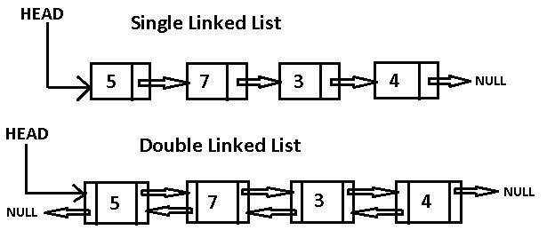

# linked list

linked list adalah adalah struktur data yang terdiri dari suatu node dan _referensi / pointer_ yang menghubungkan suatu node dengan yang lain. dimana node terakhir memiliki referensi ke _null_. setiap node memiliki data dan referensi ke node selanjutnya (_singly_) dan atau ke node sebelumnya (_doubly_). digunakan sebagai dasar implementasi _stack_ dan _queue_. tidak ada unser _random access_ via indeks seperti array dan setiap operasi hanya perlu operasi sekuensial dari node awal.



enaknya linked list bersifat dinamis secara ukuran, alokasi penggunaan _memory_ yang dibutuhkan pada _run-time_, mudah di implementasikan. akan tetapi kurangnya linked list lebih boros memory, pembacaan node hanya bisa melalui proses sekuensial dari awal. tidak layaknya via index di array.

## representasi dari linked list

setiap simpul dari linked list terdiri dari

- sebuah item data
- alamat node lain

kita membungkus item data dari refernsi node berikutnya dalam sebuah struct sebagai

```cpp
struct node {
  int data;
  struct node *next;
};
```

memahami struktur node linked list adalah kunci untuk memahaminya.setiap node struct memiliki item data dan pointer ke node struct lain. kita buat linked list sederhana dengan tiga item untuk memahami cara kerjanya

```cpp
// instalasi node

struct node *head;
struct node *pertama = NULL;
struct node *kedua = NULL;
struct node *ketiga = NULL;

// alokasi memori

pertama = malloc(sizeof(struct node));
kedua = malloc(sizeof(struct node));
ketiga = malloc(sizeof(struct node));

// menetapkan value data

pertama -> data = 1;
kedua -> data = 2;
ketiga -> data = 3;

// membuat koneksi antara node

pertama -> next = kedua;
kedua -> next = ketiga;
ketiga -> next = NULL;

// menyimpan alamat dari node pertama kedalam head

head = pertama;
```

**contoh dari linked list**

```cpp
#include <iostream>

class Node {
  public:
    int value;
    Node *next;
};

int main() {
  Node *head;
  Node *pertama = NULL;
  Node *kedua = NULL;
  Node *ketiga = NULL;

  // alokasi 3 node
  pertama = new Node();
  kedua = new Node();
  ketiga = new Node();

  // menetapkan value
  pertama -> value = 1;
  kedua -> value = 2;
  ketiga -> value = 3;

  // koneksi node
  pertama -> next = kedua;
  kedua -> next = ketiga;
  ketiga -> next = NULL;

  // print dari linked list
  head = pertama;

  while (head != NULL) {
    std::cout<<head -> value<<std::endl;
    head = head -> next;
  }

  return 0;
}
```
